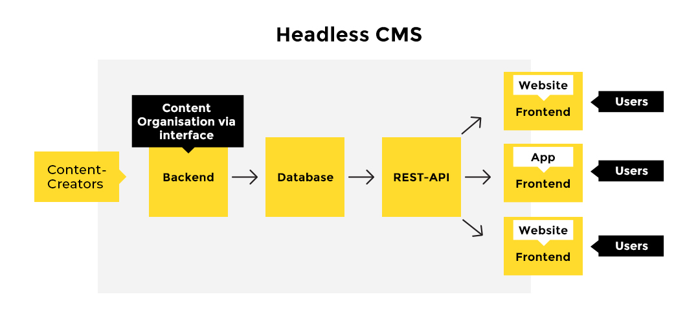
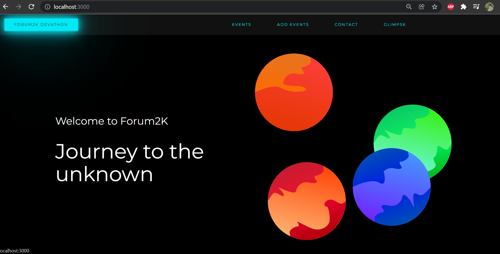
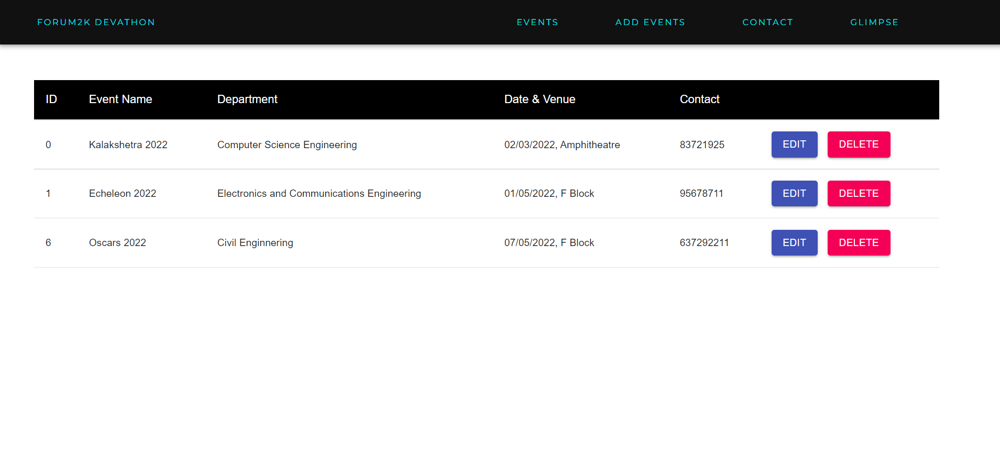
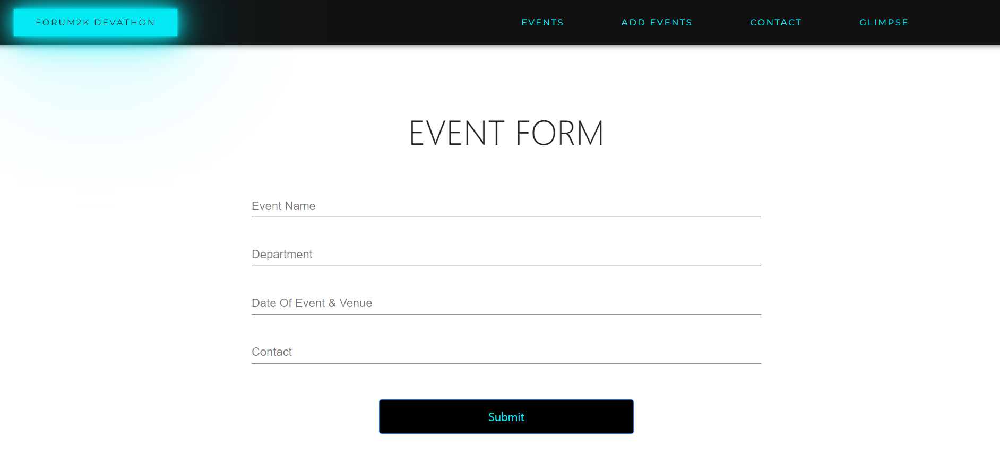
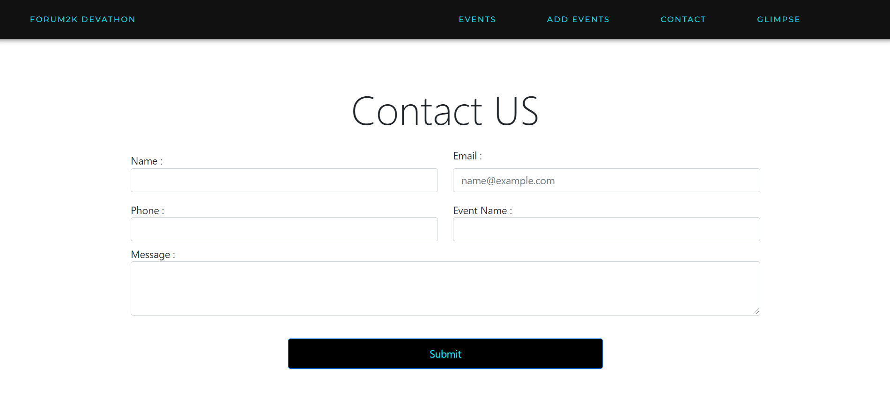
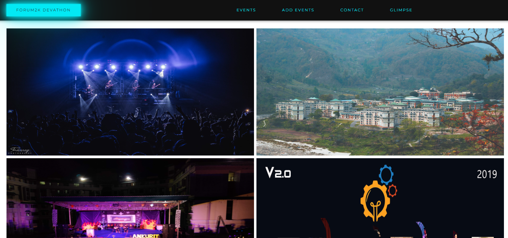

## Team Name : "runtime_terror" | Your Project Type : Web App

<!-- The participants are required to fork this repository and create a public Github repository under their own username (Single repository per team). *Clone the repo on your local system and build on top of that*

The following created sections in this README.md need to be duly filled, highlighting the denoted points for the solution/implementation. 

**Please feel free to create further sub-sections in this markdown.** The idea is to understand all the particulars of your solution in a singular document. -->

### Solution Description

```
  According to the assigned task, We have Developed a Web-App for the Forum2k.

  As per the requirements as well as additional features, The Web-App consists of 
	-Landing Page
	-List of Events Page
	-Contacts Form page
	-Event entry page
	-All the CRUD operations inbuilt
	-Admin section

  The frontend was created using React js and A hidden path was created an ADMIN section.
  Keeping that in mind, The End user cannot tamper with the events list, making it secure 
  as well as fun to explore.
    
  The backend being the heart of the Web-App where the database management happens 
  connecting the frontend to the backend was bootstraped using Node.js and MongoDB.
```

### Architecture Diagram

<div align="center">
    
</div>

### Technical Description

An overview of:
* What technologies/versions were used

  ```sh
     ReactJS | Express | MongoDB | NodeJS | npm | Framer Motion | Axios | Gasp | Styled Elements
  ```

* Setup/Installations required to run the solution

  #### To run Backend (PORT : 8080)
   ```sh
      cd backend
   ```
   * Install dependencies.
   ```sh
      npm install
  ```
  * To run the app in the development mode.
   ```sh
      node index.js
  ```
  #### To run Frontend (PORT: 3000)
   ```sh
      cd frontend
   ```
   * Install dependencies.
   ```sh
      npm install
   ```
  * To run the app in the development mode and Open http://localhost:3000 to view it in the browser.
   ```sh
      npm start
   ```

### Screenshots

<div align="center">
	
<label for="img1" ><b>Front Page</b></label>
<br>
 

<label for="img2"><b>ADMIN Page</b></label>
<br>
 
	
<label for="img3"><b>Add Event Page</b></label>
<br>
 
	
<label for="img5"><b>Contact Form Page</b></label>
<br>
 
	
<label for="img6"><b>Glimpse Page</b></label>
<br>
 
 </div>

### Team Members
List of team member names and email IDs with their contributions.
|Member Name|Email|Contribution|
|-----------|-----|------------|
|Souvik Nayak|nayaksouvik786@gmail.com|Backend, Database & Testing|
|Aditya Prasad Mishra|adimish777@gmail.com|Frontend, Ideation & Testing|

### References
Affix links to the online tools/repositories/blogs etc., which helped you along the development of the project.
